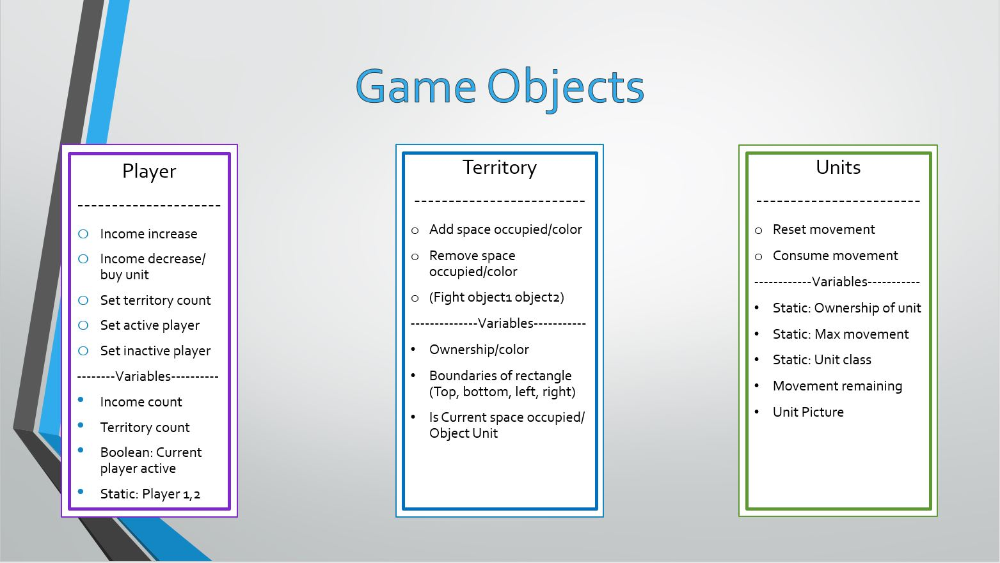
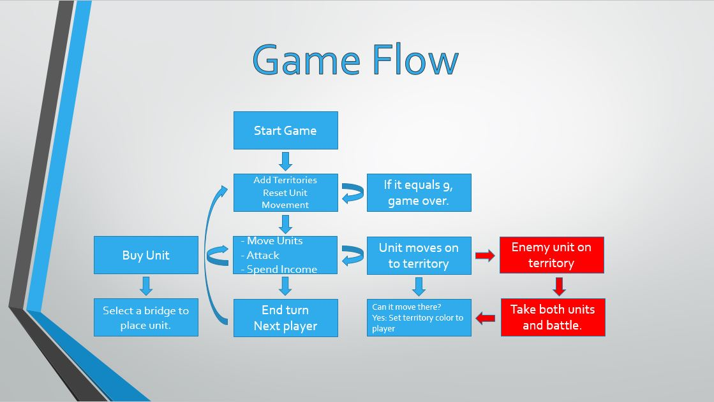
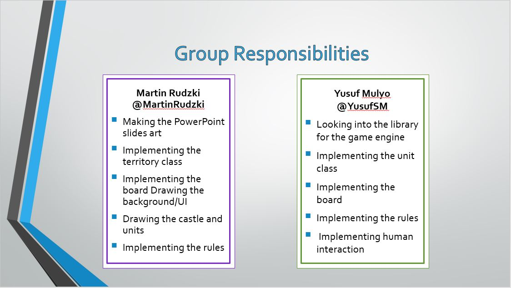

# Martin-and-Mulyo-RacketFantasy
# Project Title: Racket Fantasy

### Statement

Our project is a turn base game where two players compete for nine territories. The art of the game as well as the code itself are going to be created from scratch using the libraries available for Racket. Making a turn based game is of our interest because games like these have an element of trying to figure out what you want to do and what your opponent is trying to d. We hope to learn how to have a program where it has both user and object interaction as well as making a good game where players can enjoy together. 

### Analysis
Explain what approaches from class you will bring to bear on the project. Be explicit: e.g., will you use recursion? How? Will you use map/filter/reduce? How? Will you use data abstraction? Will you use object-orientation? Will you use functional approaches to processing your data? Will you use state-modification approaches? A combination?

The idea here is to identify what ideas from the class you will use in carrying out your project. 
We will be using HOP to manipulate the list of units. The players, tiles/territories and units are based of object-orientation. (..)

### Data set or other source materials

As of now, all the code and images we will be using are made from scratch using some graphics libraries such as htdp.

### Deliverable and Demonstration
Explain exactly what you'll have at the end. What will it be able to do at the live demo?

What exactly will you produce at the end of the project? A piece of software, yes, but what will it do? Here are some questions to think about (and answer depending on your application).

Will it run on some data, like batch mode? Will you present some analytical results of the processing? How can it be re-run on different source data?

Will it be interactive? Can you show it working? This project involves a live demo, so interactivity is good.

The game should run as we intend it to meaning a full working turn based game where players are able to spawn and control their units. We could call two people up to demonstrate and play the game against each other where they would compete for the nine teretories.

## Evaluation of Results
### Game Criteria

*Player can only control there units.

*Player income and terriroy count only increase/decrease on there turn.

*Player income decrease when income is spent on there units.

*Units get created properly on appropriate side.

*Units move.

*Units can not go out of bounds.

*Units can not be stacked on a territory.

*Units cannot move more then they are suppose to.

*Win condition is met, that means capturing 9 territories.

###Racket Libraries
(require 2htdp/universe)

(require 2htdp/batch-io)

(require 2htdp/image)

### Architecture Diagram

#Player

The main purpose of this class is to make sure that the player in control can only access their items. For example, while spending your currency on units you want to make sure that you are only touching your money and not the other players� money, even though that would be nice.

#Territory

Territories have three main responsibilities. First, boundaries, they are here to make sure that you stick with in the game. Second, if another unit is on a territory it knows how to handle it. And last, you keep track of which player owns a territory.

#Units

Units main function are to move around the board and attack other enemy units. We want to make sure that other players cannot move another players� unit. We also want to keep track of how much movement a piece has made and at the beginning of their next turn it will reset so they have a fully functioning unit again.

### Game Flow

### Schedule

### First Milestone (Fri Apr 15)
*A complete drawing of the game (background, unit, castle and UI)

*Working UI

### Second Milestone (Fri Apr 22)
*Win condition can be met.

*Units can move on gameboard.

*Currency and territory numbers are being tracked correctly.

### Final Presentation (last week of semester)
*Cleaned up most, if not all the bugs in the game

*Smoother run

## Group Responsibilities

